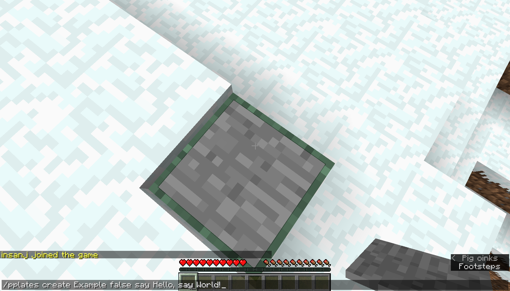
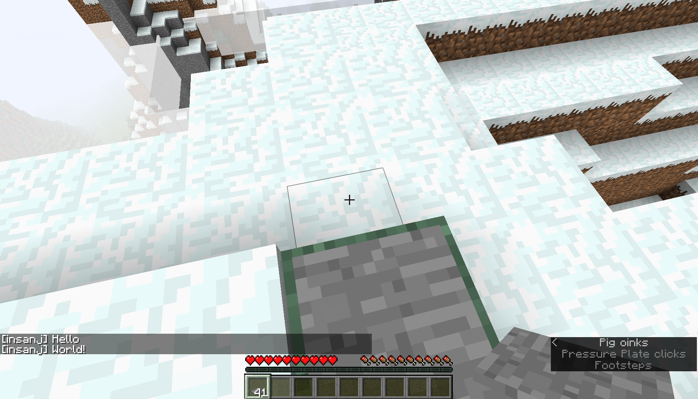

<h1 align="center">
🏹
<br/>
CommandPlates
</h1>

<h3 align="center">
bind commands to pressure plates (minecraft 1.12.2)
</h3>

<p align="center">
  <a href="https://github.com/insanj/CommandPlates/releases">
    
    
  </a>

  <a href="https://github.com/insanj/CommandPlates/">
    
  </a>

  <br/>

  <a href="https://github.com/insanj/CommandPlates/blob/master/LICENSE">
    
  </a>

  <a href="https://jdk.java.net/">
    
  </a>

  <a href="https://fabricmc.net/use/">
    
  </a>

  <a href="https://bukkit.org/threads/pressureplates.478872/">
    
  </a>

  <a href="https://github.com/insanj/CommandPlates/releases">
    
  </a>
</p>

<br/>
<br/>

<h2 align="center">
How to Play
</h2>




- Drop the `CommandPlates.jar` file into the `plugins` folder on your server.
- That's it! Only OPs can run commands unless the appropriate permission is given:
   - `pplates.admin` for the ability to create new plates
   - `pplates.use` for the ability to activate any plate
   - `pplates.<plate_name>` for the ability to activate a specific plate
- Run the following command to set up a Command Plate:
   - `/pplates create <name> <run_as_console:true/false> <command 1, command 2, ...>`
- Check in on plates by running (either as a player or as the server console):
   - `/pplates list`
   - `/pplates info <optional:plate_name>`
- Everything will be saved into the `plugins/CommandPlates/config.yml` file, which automatically fills in an example when running for the first time:

```yaml
plates:
  Example:
    author: insanj
    location:
      world: world
      x: 0
      y: 0
      z: 0
    console: true
    commands:
      - say Hello
      - say World!

```

<br/>

<h2 align="center">
How to Build
</h2>

```
make plugin
```

You will need `craftbukkit-1.12.2.jar` available on your machine. The [makefile](https://github.com/insanj/CommandPlates/blob/master/makefile) expects this to be in an `external/` directory that is not commited to git (you can change the path at the top of the file).

<br/>

<h2 align="center">
Original Request
</h2>

<a href="https://bukkit.org/threads/pressureplates.478872/
">https://bukkit.org/threads/pressureplates.478872/</a>

```

Minecraft version: 1.12.2

Suggested name: PressurePlates

What I want: I like to request a plugin to allow players to bind command or commands to pressure plates that will either execute the command(s) by player or console when the pressure plate is stepped on.

Ideas for command/permission:

pressureplate.admin

- /pplates create platename <true:false> <command_one, command_two> - Gives a pressure plate in which you can place down to execute the command. If set to true, the command will be execute by console. If set to false, it will be execute by the player. Use %player% in the command to replace the players name in commands

- /pplates list - Shows all available pressure plates

- /pplates info - While looking at a pressure plate, it will give you information about that plate

- /pplates info platename - Just another way to look up plate info directly by command


/pplates info
platename:
console: true/false
- command_one
- command_two

/pplates list
List of available pressure plates.
- platename
- platename2
- platename3

pressureplate.use
This is default player permission needed to use any of the pressure plates.

pressureplate.platename
Players would also need pressureplate.platename permissions to execute certain pressure plate

config.yml or pressureplates.yml to store all data

Thank you for reading.
```

<h2 align="center">
Acknowledgements
</h2>

- https://bukkit.org/threads/cant-detect-if-player-stands-on-pressure-plate.190533/
- https://www.spigotmc.org/threads/get-block-player-is-standing-on.131668/

<h2 align="center">
Authors
</h2>

<p align="center">
  (c) 2019 Julian Weiss (insanj). Made with 💚 in Brooklyn. <a href="http://insanj.com">insanj.com</a>.
</p>

<br/>

<h2 align="center">
License
</h2>

```
MIT License

Copyright (c) 2019 Julian Weiss

Permission is hereby granted, free of charge, to any person obtaining a copy
of this software and associated documentation files (the "Software"), to deal
in the Software without restriction, including without limitation the rights
to use, copy, modify, merge, publish, distribute, sublicense, and/or sell
copies of the Software, and to permit persons to whom the Software is
furnished to do so, subject to the following conditions:

The above copyright notice and this permission notice shall be included in all
copies or substantial portions of the Software.

THE SOFTWARE IS PROVIDED "AS IS", WITHOUT WARRANTY OF ANY KIND, EXPRESS OR
IMPLIED, INCLUDING BUT NOT LIMITED TO THE WARRANTIES OF MERCHANTABILITY,
FITNESS FOR A PARTICULAR PURPOSE AND NONINFRINGEMENT. IN NO EVENT SHALL THE
AUTHORS OR COPYRIGHT HOLDERS BE LIABLE FOR ANY CLAIM, DAMAGES OR OTHER
LIABILITY, WHETHER IN AN ACTION OF CONTRACT, TORT OR OTHERWISE, ARISING FROM,
OUT OF OR IN CONNECTION WITH THE SOFTWARE OR THE USE OR OTHER DEALINGS IN THE
SOFTWARE.
```
